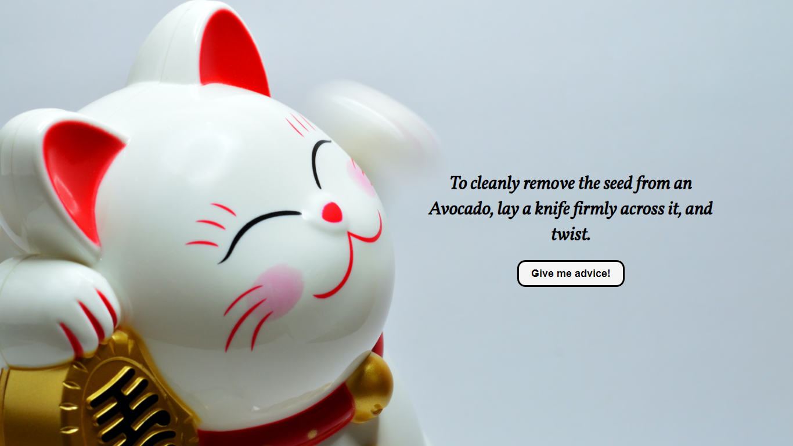

# Good Advice Cat App

## Description

The Good Advice Cat App is a simple, intuitive web application that provides users with random pieces of advice at the click of a button. Developed using React and Axios for API requests, this application fetches advice from the "Advice Slip JSON API" to inspire and entertain users.

## Features

- **Instant Advice Retrieval:** Utilizes Axios to fetch random advice from a reliable API.
- **Simple User Interface:** Features a minimalistic design for ease of use.
- **One-Click Functionality:** Users can receive new advice with just a single click.
- **Responsive Design:** Optimized for both desktop and mobile devices, ensuring a seamless experience across all platforms.

## Usage

1. **Viewing Advice:** Upon loading, the app displays a piece of advice in a stylish card layout.
2. **Fetching New Advice:** Click the "Give me another advice!" button to load new advice.
3. **No Refresh Needed:** The app dynamically updates the advice without needing to refresh the page.

## Dependencies

- [React](https://reactjs.org/)
- [Axios](https://axios-http.com/)
- [Advice Slip JSON API](https://api.adviceslip.com/)

## Screenshot

## Live Application

Explore and enjoy different pieces of advice: [Live Build](https://good-advice-cat.netlify.app/)

The live version provides a hands-on experience of the Advice Generator App, allowing you to explore its functionality effortlessly.

## Installation

No installation is required for the live version. For development purposes, clone the repository, install dependencies using `npm install`, and start the local server using `npm start`.

## Repository

Access the source code and contribute to the project: [GitHub - Advice Generator App](https://github.com/Pav85/good-advice-cat-app)

## License

This project is open source and available under the MIT License.